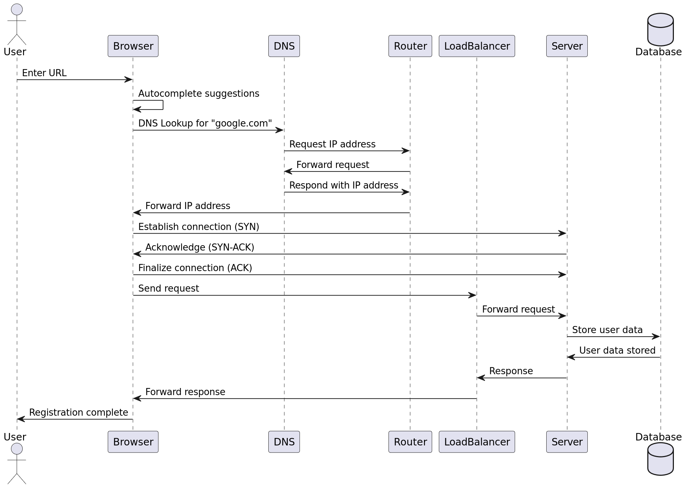

# What Happens When You Type "google.com" in Your Browser and Press Enter?

When you type "google.com" into your browser's address bar and press Enter, a complex series of actions are initiated to interpret your intent, establish a secure connection, and display the desired webpage. Here’s a detailed breakdown of each step:

## 1. Autocomplete and Search Engine Check (Pre-Enter)

### Autocomplete Suggestions
- **Browsing History and Bookmarks**: As you start typing "google.com", your browser scans your browsing history and bookmarks. If a match is found, it displays autocomplete suggestions to save you time.
- **Default Search Engine**: If no match is found, the browser might interpret "google.com" as a search term for your default search engine (e.g., Google Search).

## 2. Protocol and Port Selection

### Choosing the Appropriate Protocol
- **HTTP (Hypertext Transfer Protocol)**: An older, less secure communication protocol.
- **HTTPS (Hypertext Transfer Protocol Secure)**: A more secure version of HTTP that encrypts data transmission.
- **HSTS (HTTP Strict Transport Security)**: If "google.com" is on the browser's HSTS list, it automatically chooses HTTPS for a secure connection.

### Port Selection
- **Port 80**: Standard for HTTP.
- **Port 443**: Standard for HTTPS.

## 3. Finding the IP Address (DNS Lookup)

### DNS Lookup Process
- **Cache Check**: The browser checks its cache for a recently looked-up IP address for "google.com".
- **Hosts File**: It checks the hosts file on your device for domain-IP mappings.
- **DNS Request**: If the IP is not found, the browser sends a DNS request to your default DNS server (e.g., Google Public DNS 8.8.8.8).

### DNS Request Journey
- **Router Role**: The router forwards this request, modifying the packet with your public IP address before sending it to the internet.
- **DNS Server Response**: The DNS server looks up "google.com" and sends back the IP address.
- **Response Delivery**: The router forwards the IP address to your browser.

## 4. Establishing a Secure Connection (TCP Three-Way Handshake)

### TCP Three-Way Handshake
- **SYN Packet**: The browser sends a SYN packet with a sequence number to Google's server.
- **SYN-ACK Packet**: The Google server responds with a SYN-ACK packet, acknowledging the request and including its own sequence number.
- **ACK Packet**: The browser sends an ACK packet to acknowledge the server.

## 5. HTTPS/SSL (Secure Sockets Layer)

### Establishing a Secure Channel
- **HTTPS**: Encrypts data transmission between your browser and the server.
- **SSL/TLS (Transport Layer Security)**: Cryptographic protocol for secure communication.

## 6. Load-Balancer and Server Interaction

### Request Handling
- **Load-Balancer**: Distributes incoming network traffic across multiple servers to prevent any single server from becoming overwhelmed.
- **Web Server**: Handles HTTP(S) requests and serves static content like HTML, CSS, and JavaScript files.
- **Application Server**: Processes dynamic content requests, executes business logic, and interacts with the database.
- **Database**: Manages data storage and retrieval.

### Response Path
- **Application Server**: Processes data and sends the response back to the web server.
- **Web Server**: Sends the response to the load-balancer.
- **Load-Balancer**: Forwards the response to the client through the established secure connection.

## 7. Data Exchange

### Ongoing Communication
- **Sequence and Acknowledgment Numbers**: Ensure data packets are in order.
- **Flow Control and Congestion Control**: Mechanisms like Slow Start, Congestion Avoidance, Fast Retransmit, and Fast Recovery manage data flow and avoid congestion.
- **Packet Exchange**: During a long-running connection, many packets are exchanged, some containing application data and others only acknowledgments.

